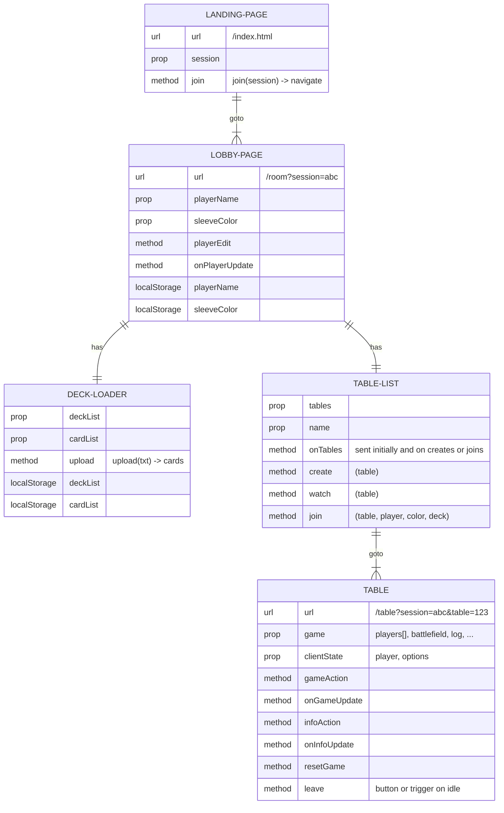
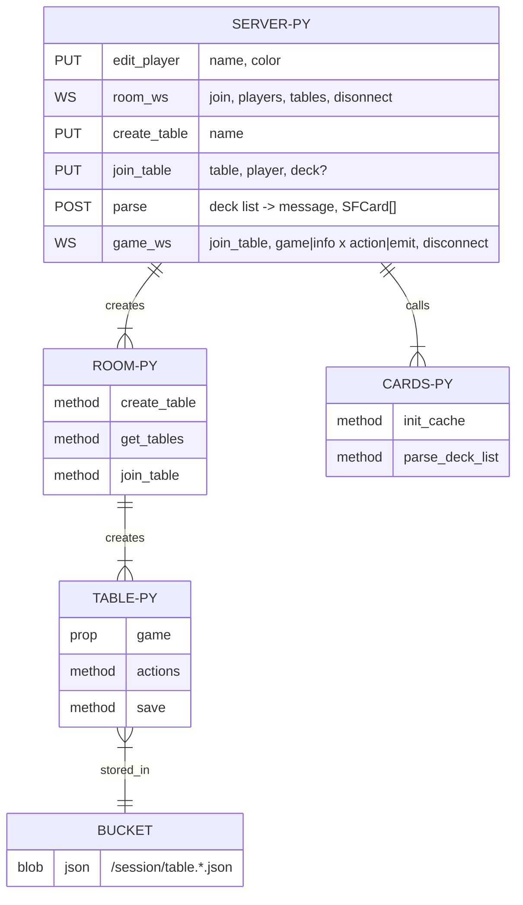

Front End "not-quite entity relationship" diagram:

Back End "not-quite entity relationship" diagram:

The above are based on an earlier design doc I made at [diagrams.net](https://app.diagrams.net/#G1VzVYroTFGN9OCPzqnnTsSIXlY-MaFofX).

The current code doesn't match these exactly, but does follow the same general ideas.
